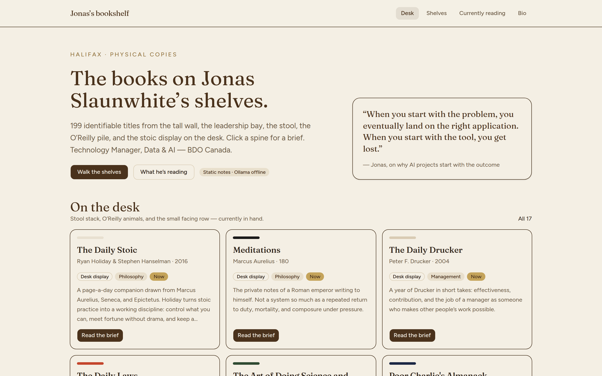
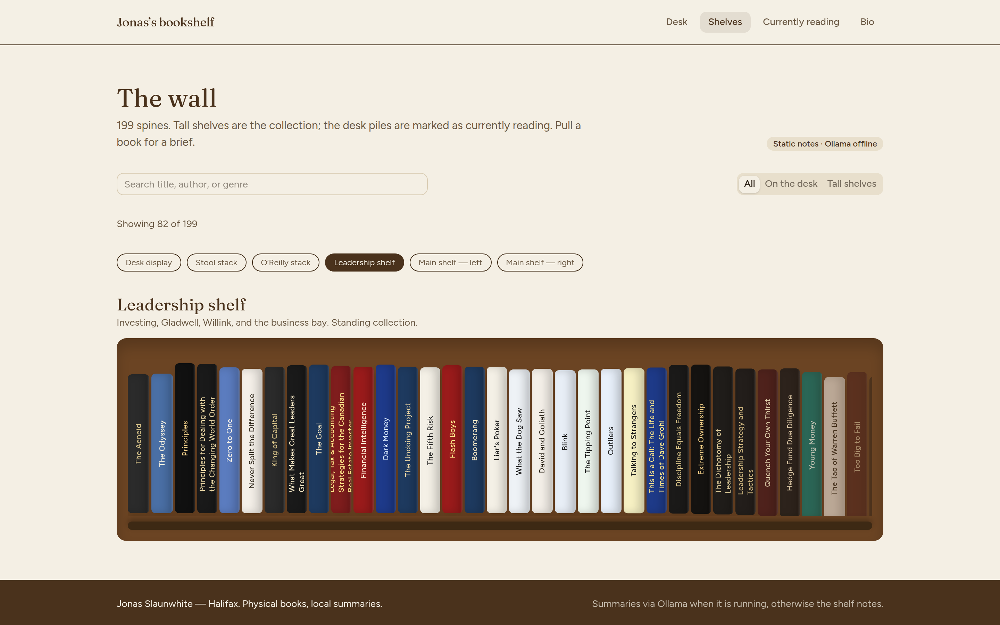
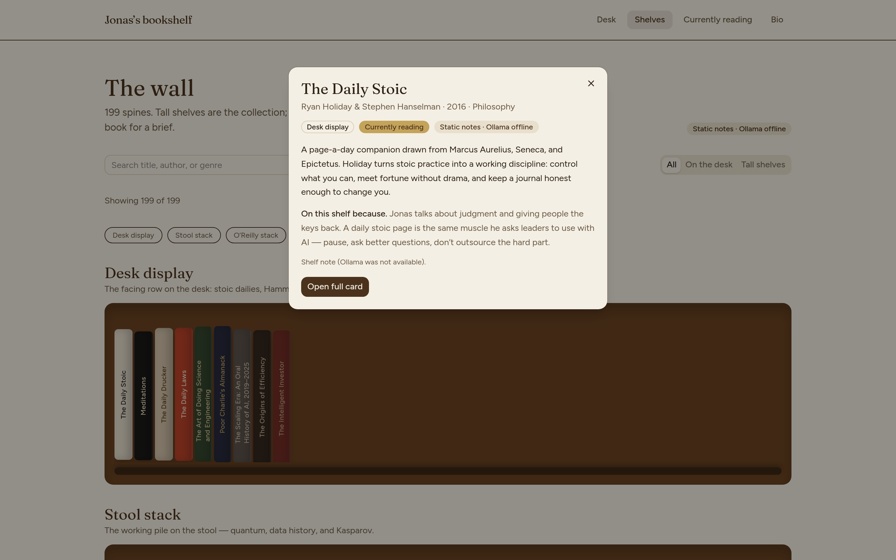
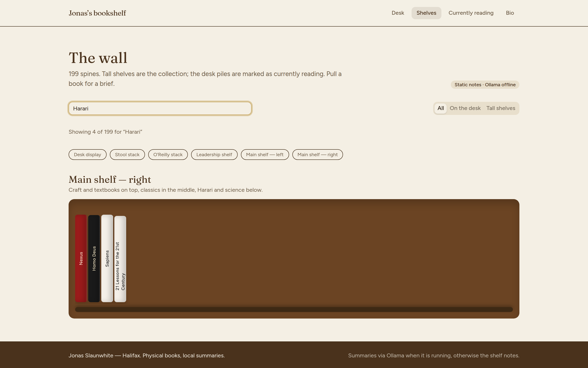
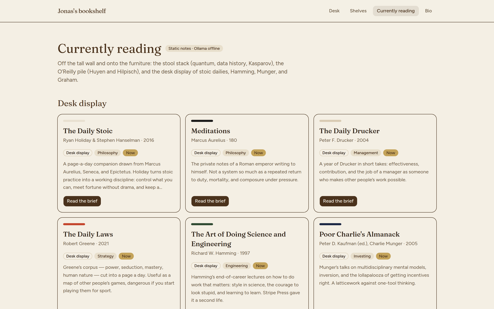
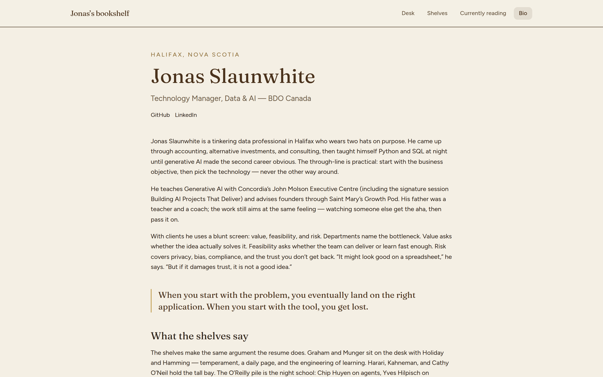
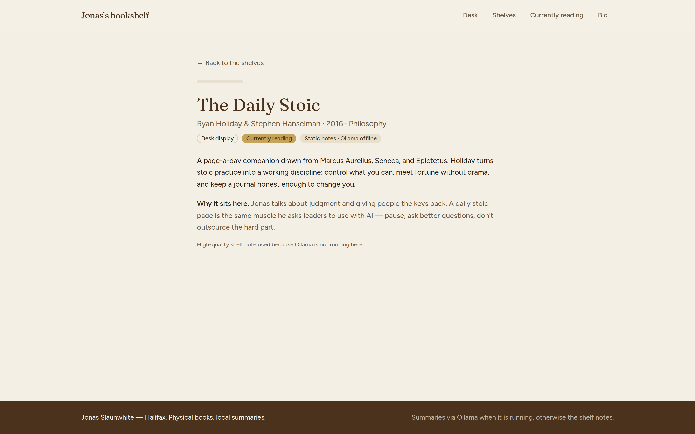
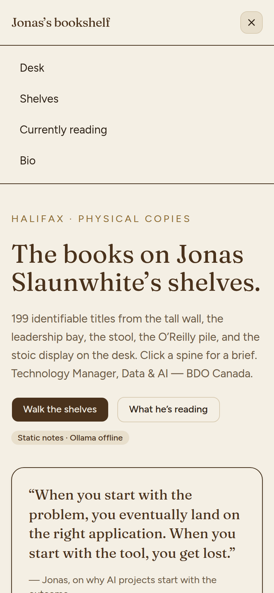

# Jonas’s bookshelf

A personal library site for **Jonas Slaunwhite** — Technology Manager, Data & AI at BDO Canada, based in Halifax. Visitors can walk the physical shelves, open a spine for a short brief, see what is currently on the desk, and read a bio drawn from his public work.

The catalog is **199 identifiable titles** photographed from the six real bays: the tall wall, the leadership shelf, the stool stack, the O’Reilly pile, and the stoic/investor row on the desk. Briefs try a local [Ollama](https://ollama.com) model first and fall back to the static shelf notes if Ollama is not running.



## Features

### The wall

`/shelves` renders the six photographed bays as an animated wall. [Anime.js](https://animejs.com) staggers the spines in, then lifts a title on hover. Filter by **All**, **On the desk**, or **Tall shelves**, or tap a bay chip (desk display, stool, O’Reilly, leadership, main-left, main-right).



Click a spine for a brief overlay: title, shelf, whether it is currently reading, and a short “why it sits here.” The overlay waits a beat before the backdrop can close it, so the opening click does not dismiss the card. **Open full card** goes to `/book/[id]`.



Search is a native input over title, author, and genre, with a live “Showing *n* of 199” count. Empty searches and unknown book ids get a visible misshelved state instead of a blank page.



### On the desk

`/` shows the working quote and a preview of what is in hand. `/currently-reading` groups the **17** desk copies by pile: stool (quantum, data history, Kasparov), O’Reilly (Huyen and Hilpisch), and the facing stoic/investor row (Holiday, Hamming, Munger, Graham).



### Bio and a single title

`/bio` is the career, method, and what the collection implies — Concordia teaching, the BDO path, and the public projects. `/book/[id]` is the same brief as the overlay, on its own page, with an Ollama or shelf-note attribution.





### Mobile

Below the `md` breakpoint the nav collapses to a menu that actually opens (Desk, Shelves, Currently reading, Bio).

<p>
  
</p>

An **Ollama** / **Static notes** badge on the desk, wall, and briefs shows whether a local model is answering.

## Run locally

Needs Node.js 20+.

```bash
npm install
npm run dev
```

Open [http://127.0.0.1:4731](http://127.0.0.1:4731). The Next.js dev client allows `127.0.0.1` and `localhost` as origins so the spines, search, and mobile menu hydrate.

Optional Ollama (summaries stay useful without it):

```bash
ollama serve
ollama pull llama3.2:3b
```

Environment (all optional — defaults work for local mock):

```
OLLAMA_HOST=http://127.0.0.1:11434
OLLAMA_MODEL=llama3.2:3b
```

Copy `.env.example` to `.env.local` if you want to pin a model.

## What’s in here

| Route | What you get |
| --- | --- |
| `/` | Desk pile preview and the working quote |
| `/shelves` | Six photographed bays as an animated, searchable wall |
| `/currently-reading` | Stool, O’Reilly, and the stoic/investor display |
| `/bio` | Career, method, and what the collection implies |
| `/book/[id]` | A single title, with an Ollama brief when available |

The catalog is `src/data/catalog.json` (titles read from the six shelf photos, last updated 2026-09-18). Tall shelves are the standing collection; the stool, O’Reilly stack, and small display row are marked currently reading. Main-right’s bottom row and main-left’s top row are the same physical shelf — catalogued once.

JSON helpers live under `/api/books` (search / shelf / currently-reading), `/api/status` (Ollama reachability), and `POST /api/summary` (brief for one `bookId`).

## Stack

Next.js 16 (App Router) · React 19 · TypeScript · Tailwind 4 · shadcn/ui · Anime.js · Ollama
